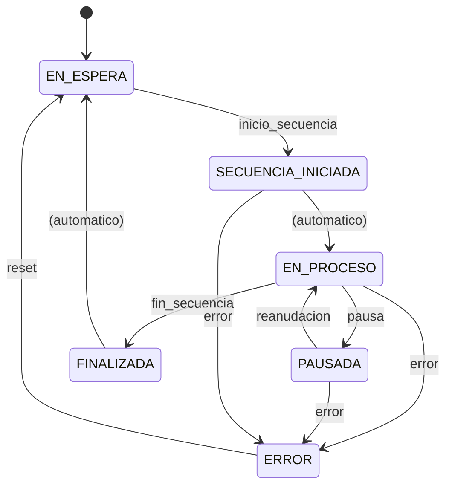

# Protocolo jaula-elevacion-hmi → MES-OEE-jaula

Spec de comunicación de estado entre la **jaula de elevación** (productor) y **MES/OEE** (consumidor).

## 1. Objetivo

MES-OEE-jaula necesita conocer en tiempo real el estado de la jaula para:
- Pintar la pantalla de plan de producción (State Timeline).
- Calcular OEE (disponibilidad / rendimiento / calidad).

La jaula debe informar, como mínimo, cuando: **se inicia una secuencia**, **se pausa**, y **la máquina entra en error**.

## 2. Roles

| App | Rol |
|-----|-----|
| jaula-elevacion-hmi | **Productor**: publica cada cambio de estado. |
| MES-OEE-jaula | **Consumidor**: se suscribe y reacciona. |

Comunicación desacoplada: la jaula no necesita saber si MES está escuchando.

## 3. Transporte recomendado: MQTT

MQTT encaja por ser pub/sub ligero, ideal para telemetría de estado, fácil en Python (`paho-mqtt`) y con broker (Mosquitto) en Docker.

- **QoS 1** (at least once) en los eventos de estado: MES no puede perder un cambio.
- **Mensaje retenido (retained)** en el topic de estado: una instancia de MES que se conecte de nuevo recibe al instante el último estado conocido.
- **LWT (Last Will and Testament)**: si el proceso de la jaula muere, el broker avisa a MES → hueco de disponibilidad para OEE.

> Alternativas: **OPC-UA** si hay integración directa con PLC; **REST/webhook** si se prefiere algo más simple. El modelo de estados de abajo es válido para cualquiera de ellos.

## 4. Estados (enum canónico)

| Estado | Significado | Color en State Timeline |
|--------|-------------|--------------------------|
| `EN_ESPERA` | Sin secuencia activa, esperando | Amarillo |
| `SECUENCIA_INICIADA` | Arranque de secuencia | Verde |
| `EN_PROCESO` | Ejecutando secuencia | Verde |
| `PAUSADA` | Pausada por operario o condición | Ámbar / propio |
| `ERROR` | Máquina en error | Rojo |
| `FINALIZADA` | Secuencia terminada | Amarillo (con flag `dentro_de_tiempo`) |
| *(offline vía LWT)* | Proceso de jaula caído | Gris / hueco disponibilidad |

## 5. Eventos (transiciones)

`inicio_secuencia` · `pausa` · `reanudacion` · `error` · `reset` (recuperación) · `fin_secuencia`

## 6. Topics

| Topic | Uso | QoS | Retained |
|-------|-----|-----|----------|
| `planta/jaula/{jaula_id}/estado` | Eventos de estado | 1 | Sí |
| `planta/jaula/{jaula_id}/conexion` | Disponibilidad (online/offline) | 1 | Sí (+ LWT) |

`{jaula_id}` p.ej. `JAULA-01`.

## 7. Esquema del mensaje de estado (JSON)

```json
{
  "ts": "2026-06-21T10:32:14.512Z",
  "jaula_id": "JAULA-01",
  "estado": "EN_PROCESO",
  "evento": "inicio_secuencia",
  "secuencia_id": "SEC-03",
  "tiempo_teorico_s": 420,
  "duracion_real_s": null,
  "dentro_de_tiempo": null,
  "error": null,
  "operario": "fje"
}
```

Campos:
- `ts`: timestamp ISO-8601 UTC del cambio de estado.
- `estado`: uno del enum (sección 4).
- `evento`: qué disparó el cambio (sección 5).
- `secuencia_id`: `null` si no hay secuencia activa.
- `tiempo_teorico_s`: tiempo teórico de la secuencia (para el eje X del timeline).
- `duracion_real_s` / `dentro_de_tiempo`: se rellenan al `FINALIZADA`.
- `error`: objeto solo cuando `estado == ERROR`.

### Mensaje de error

```json
{
  "ts": "2026-06-21T10:40:02.117Z",
  "jaula_id": "JAULA-01",
  "estado": "ERROR",
  "evento": "error",
  "secuencia_id": "SEC-03",
  "error": {
    "codigo": "E-204",
    "descripcion": "Sobrecarga motor elevacion",
    "severidad": "critico"
  }
}
```

### Mensaje de fin de secuencia

```json
{
  "ts": "2026-06-21T10:39:05.880Z",
  "jaula_id": "JAULA-01",
  "estado": "FINALIZADA",
  "evento": "fin_secuencia",
  "secuencia_id": "SEC-03",
  "tiempo_teorico_s": 420,
  "duracion_real_s": 405,
  "dentro_de_tiempo": true
}
```

### Mensaje de disponibilidad (`/conexion`)

Al conectar (retained): `{ "online": true,  "ts": "..." }`
LWT (lo publica el broker si la jaula cae): `{ "online": false, "ts": "..." }`

## 8. Máquina de estados



## 9. Ejemplo de ciclo completo

1. `EN_ESPERA` (evento previo / arranque)
2. `SECUENCIA_INICIADA` — evento `inicio_secuencia`, `secuencia_id=SEC-03`
3. `EN_PROCESO`
4. `PAUSADA` — evento `pausa`
5. `EN_PROCESO` — evento `reanudacion`
6. `FINALIZADA` — evento `fin_secuencia`, `dentro_de_tiempo=true`
7. `EN_ESPERA`

Caso de error: desde `EN_PROCESO` → `ERROR` (evento `error`, con `error.codigo`) → al resolver, `reset` → `EN_ESPERA`.

## 10. Reglas de implementación

- La jaula publica **solo en cambios de estado** (no en bucle), salvo el heartbeat/keepalive de conexión.
- Todo mensaje lleva `ts` en UTC; el reloj de jaula y MES deben estar sincronizados (NTP).
- MES persiste cada evento en la base de datos de series temporales que alimenta el State Timeline y el cálculo de OEE.
- `error.severidad`: `aviso` | `critico`. Solo `critico` cuenta como parada para disponibilidad.
